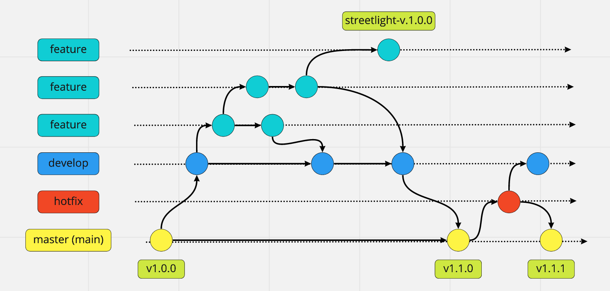

# Git Specification

## Git Flow 

### Branch
- master(main)
```
名稱規範: master or main
放穩定、隨時可上線的版本。這個分支的來源只能從別的分支合併過來，開發者不會直接 Commit 到這個分支。因為是穩定版本，所以通常也會在這個分支上的 Commit 上打上版本號標籤。
```
- develop
```
名稱規範: develop
所有開發的基礎分支，當要新增功能的時候，所有的 Feature 分支都是從這個分支切出去的。而 Feature 分支的功能完成後，也都會合併回來這個分支。此分支的最新 commit 將會部署至公開測試環境，以方便大家測試。
```
- hotfix
```
名稱規範: hotfix/${name} (${name} 請使用 camel case)

當線上產品發生緊急問題的時候，會從 Master 分支開一個 Hotfix 分支出來進行修復，Hotfix 分支修復完成之後，會合併回 Master 分支，也同時會合併一份到 Develop 分支。

為什麼要合併回 Develop 分支？如果不這麼做，等到時候 Develop 分支完成並且合併回 Master 分支的時候，那個問題就又再次出現了。

那為什麼一開始不從 Develop 分支切出來修？因為 Develop 分支的功能可能尚在開發中，這時候硬是要從這裡切出去修再合併回 Master 分支，只會造成更大的災難。
```
- feature
```
名稱規範: feature/${name} (${name} 請使用 camel case)

當要開始新增功能的時候，就是使用 Feature 分支的時候了。Feature 分支都是從 Develop 分支來的，完成之後會再併回 Develop 分支。

// 從 develop 新增 feature 分支出去
git checkout -b feature/${name} develop

// 完成後回到 develop 分支
$ git checkout develop

// feature merge 到 develop
$ git merge feature/${name}

// 刪除 feat 分支
$ git branch -d feature/${name}

// 上傳 develop 至 remote
$ git push origin develop
```
```
情境：獨立的 feature 分支

分支有可能永遠不會合併回 develop，例如 Moxa 公司向我們購買的路燈平台，有一些量身定做客製化的程式碼，我們則可以創建一個分支取名為 feature/moxa 。當開發完成後，可以打一個 moxa-v1.0.0 的 tag，此時就會創建一個新的測試環境
```


---
## Git Commit Message
[參考來源](https://medium.com/dev-chill/%E4%BD%BF%E7%94%A8-git-commit-template-%E7%AE%A1%E7%90%86-git-log-cb70f95fda2f)

```
 commit log 請遵造以下格式，並注意冒號後面有一個空格 
 
 <type>: <subject> {必要}
 
 <body> {非必要}
 
 <footer> {非必要}
 
 <Type>
 請遵守下列標籤
 feat: 新功能
 fix: Bug修復
 docs: 文檔改變
 style: 代碼格式改變
 refactor: 功能重構
 perf: 性能優化
 test: 增加測試代碼
 build: 改變build工具
 ci: 與ci相關的設定
 add: 增加一些跟功能無關的檔案
 3rd: 增加第三方
 
 <Subject>
 用來簡要描述影響本次變動，概述即可
 
 <Body>
 具體的修改訊息，越詳細越好
 
 <Footer>
 如果是要關閉特定 Issue 或 Bug. 可以使用 Closes PROJECT-1 or Resolves PROJECT-1 or Fixes PROJECT-1
```
---
**EXAMPLE**

feat: implementation login api function

finished login module and integration with server login api

Closes OR-xxxx 

---